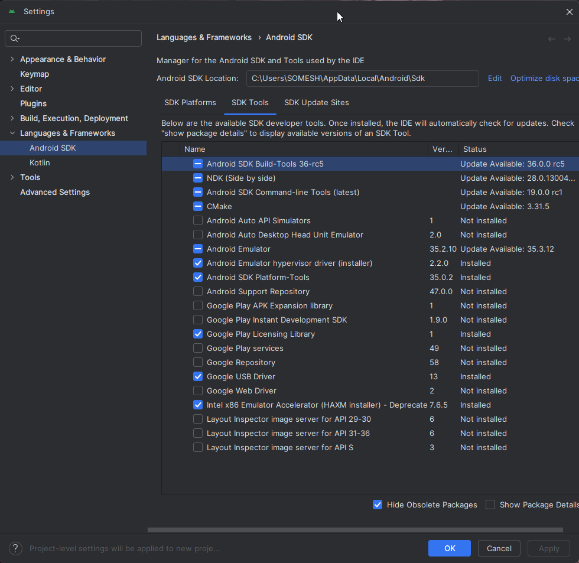
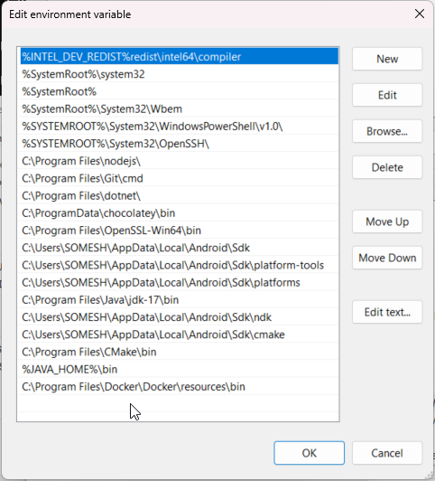
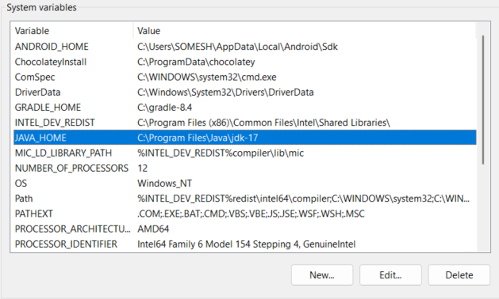
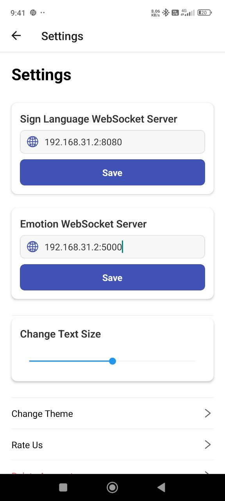

# Setup Guide for Java, Android SDK, and Gradle

## ⚠️ BIG WARNING: CHECK YOUR PATHS MANUALLY ⚠️
The paths in this guide may differ from your system. Before proceeding, manually verify where Java, Gradle, and Android SDK are installed on your system. Use the example images below as a reference, but always check your own installation paths.

## 1️⃣ Install Java JDK 17

Download and install Java JDK 17 from:
[Java JDK 17 Download](https://adoptium.net/)

After installation, verify the installation:
```sh
java -version
```
Example output:
```
openjdk version "17.0.3" 2022-04-19
```

## 2️⃣ Install Android Platform Tools

Download Android SDK Platform Tools from:
[Android SDK Platform Tools](https://developer.android.com/studio/releases/platform-tools)

Extract it and move it to a location like:
```
C:\Users\YourUsername\AppData\Local\Android\Sdk\platform-tools
```

Verify installation:
```sh
adb version
```
Example output:
```
Android Debug Bridge version 1.0.41
```

## 3️⃣ Install Gradle 8.4

Download and install Gradle 8.4 from:
[Gradle Releases](https://gradle.org/releases/)

Extract Gradle to a location like:
```
C:\Gradle\gradle-8.4
```

Verify installation:
```sh
gradle -v
```
Example output:
```
Gradle 8.4
```

## 4️⃣ Set Environment Variables

### Add the following paths to **System Environment Variables**:
#### System Variable Path:
```
C:\Users\YourUsername\AppData\Local\Android\Sdk
C:\Users\YourUsername\AppData\Local\Android\Sdk\platform-tools
C:\Users\YourUsername\AppData\Local\Android\Sdk\platforms
C:\Program Files\Java\jdk-17\bin
C:\Users\YourUsername\AppData\Local\Android\Sdk\ndk
C:\Users\YourUsername\AppData\Local\Android\Sdk\cmake
C:\Program Files\CMake\bin
%JAVA_HOME%\bin
```

### Add System Variables:
#### 1. ANDROID_HOME
```
C:\Users\YourUsername\AppData\Local\Android\Sdk
```
#### 2. GRADLE_HOME
```
C:\Gradle\gradle-8.4
```
#### 3. JAVA_HOME
```
C:\Program Files\Java\jdk-17
```

## 5️⃣ Install Required Components in Android Studio

Open **Android Studio** and go to:
- **File** → **Settings** → **Appearance & Behavior** → **System Settings** → **Android SDK**
- Click on the **SDK Tools** tab and install the following:
  - ✅ Android SDK Build-Tools 36-rc5
  - ✅ Android SDK Platform-Tools
  - ✅ Android Emulator
  - ✅ Intel x86 Emulator Accelerator (HAXM installer)
  - ✅ Google USB Driver
  - ✅ CMake (latest version)
  - ✅ NDK (Side by Side)

Make sure these tools are installed and updated.

## 6️⃣ Verify Everything is Working

Restart your computer to apply the environment variables, then check:
```sh
java -version
gradle -v
adb version
```

🎉 Now your system is ready for Android and React Native development!

## 📷 Example System Variables & Android Studio Setup
Below are example images showing the correct system variable setup and Android Studio SDK configurations:





🚨 **BIG WARNING AGAIN** 🚨
Check these settings manually to match your system before proceeding!

---

## 📱 Setup React Native App (Gesture-Connect)

### 1️⃣ Navigate to the project directory:
```sh
cd Gesture-Connect
```

### 2️⃣ Install dependencies:
```sh
npm install
```

### 3️⃣ Run the app on Android:
```sh
npx expo run:android
```

### ⚠️ Do not use an emulator! Connect your mobile device via ADB.
If you face issues, search on YouTube for tutorials on connecting a mobile device via ADB.

---

## 🚀 Start the Backend Server

### 1️⃣ Navigate to the server directory:
```sh
cd server
```

### 2️⃣ Install dependencies:
```sh
pip install -r requirements.txt
```

### 3️⃣ Run the server:
```sh
python server.py
```

### 4️⃣ Start the emotion server in another terminal:
```sh
python emotion_server.py
```

---

## 📡 Network Configuration

The servers are running on the following ports:
- **Sign Language Server:** `localhost:8080`
- **Emotion Server:** `localhost:5000`

To run the app, ensure your **mobile device and laptop are on the same WiFi network**.

### Find your IPv4 Address:
- **Windows:** Run `ipconfig` in the terminal.
- **Linux/macOS:** Run `ifconfig` in the terminal.

Example output:
```
192.168.XX.XX
```
Example:
```
192.168.31.2
```

### Update App Settings
- **Sign Language Server:** `192.168.XX.XX:8080`
- **Emotion Server:** `192.168.XX.XX:5000`

Here is the reference image below. You can also see that an **APK release** is available, which you can install directly and run—just start the server!



🚀 Now your React Native app is ready to use!

